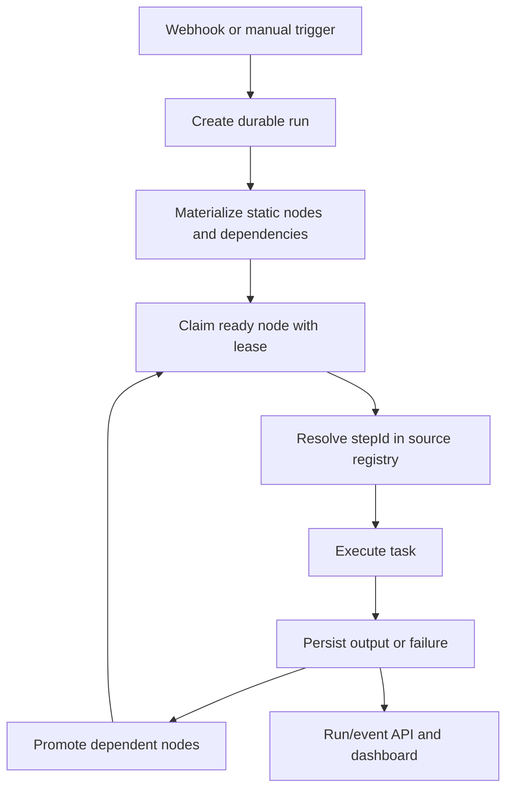

# RFD0001 - LibClank Durable Workflow Runtime

- Feature Name: `libclank-durable-workflows`
- Start Date: `2026-09-19`
- Status: Snapshot / implemented foundation

## Summary

LibClank is a typed, code-first runtime for defining and operating agentic workflows as durable execution graphs. Workflows are authored in TypeScript using Effect and remain source code; durable storage records execution facts rather than closures. The runtime persists workflow definitions, runs, step instances, dependencies, attempts, outputs, artifacts, leases, and events. Local execution uses portable SQLite, while the scheduler contracts are compatible with Cloudflare Durable Objects. An operational React dashboard displays workflow topology, run state, and event logs.

This RFD records the design implemented so far and identifies the remaining work before the runtime should be considered production-complete.

## Motivation

Agent workflows often begin as ordinary application code: fetch a document, ask an agent to analyze it, write an artifact, and perform follow-up work. As soon as the workflow must survive a process restart, retry a failed step, run branches concurrently, or explain its current state to an operator, ordinary call-stack execution is insufficient.

LibClank addresses that gap while preserving a code-first authoring model:

- workflow authors compose typed nodes and tasks in source code;
- closures and agent implementations remain in the deployed source bundle;
- the database stores only stable identifiers and JSON/artifact execution facts;
- schedulers can recover work without reconstructing a JavaScript call stack;
- operators can inspect the topology and event history without authoring workflows in a UI.

Typical workflows include:

1. A webhook receives a URL, an agent fetches Markdown, and parallel agents analyze topic, style, and confidence.
2. A collection is processed with one durable step instance per item.
3. A failed run is retried from persisted step inputs.
4. A process is restarted after a lease expires and continues from completed work.
5. An operator opens a run page and sees graph state, attempts, outputs, and logs.

## Guide-level explanation

### Code-first workflows

A workflow is composed from `Node` and `Task` values:

```ts
const trigger = Triggers.webhook<Request>({
  id: Id.trigger("analyze-url"),
  path: "/hooks/analyze-url",
  decode: decodeRequest,
})

const fetchMarkdown = Task.fn({
  id: Id.node("fetch-markdown"),
  run: fetchMarkdownFromSource,
})

const workflow = trigger.then(fetchMarkdown)
```

Composition produces a static graph and a source-loaded executable registry. The registry maps each persisted `stepId` back to the executable `Node`. The function itself is not serialized.

A `taskId` identifies reusable source code. A `stepId` identifies a particular workflow call site. Reusing a task in multiple branches therefore produces distinct durable step identities.

### Durable execution

When a trigger arrives, LibClank:

1. creates a run record;
2. records trigger and scheduling events;
3. materializes static workflow nodes;
4. records dependency links;
5. marks root nodes ready and dependent nodes pending;
6. claims ready nodes using leases;
7. resolves each node through the source-loaded registry;
8. validates input and output boundaries when schemas are supplied;
9. persists output or failure state;
10. promotes downstream nodes when dependencies complete.

The database, not the in-memory call stack, is authoritative.



### Parallel branches

A fan-out topology is represented as dependency edges rather than nested execution in the scheduler:

```text
trigger
  → fetch Markdown
    → topic analysis → open topic artifact
    → style analysis → open style artifact
    → confidence analysis → open confidence artifact
```

Each branch receives the persisted output of its parent. Reused call sites have unique `stepId`s, so branch-specific dependencies remain distinguishable.

### Dynamic collection processing

`mapEach` has a static template and runtime instances. Given a collection, the scheduler creates deterministic instances such as:

```text
summarize-link[0]-<hash>
summarize-link[1]-<hash>
summarize-link[2]-<hash>
```

Each instance persists its own input, status, attempt count, output, and artifacts. Fan-in waits for all instances before promoting downstream work.

### Operational dashboard

The dashboard is read-only with respect to workflow authoring. It provides:

- latest registered workflow versions;
- trigger buttons labelled `Start`;
- run listing;
- React Flow run graph;
- node status and attempt display;
- right-hand run event/log column;
- persisted run outputs and errors.

The current dashboard refreshes runs and logs by polling. SSE/WebSocket streaming is planned but not yet implemented.

## Reference-level explanation

### Core model

The core package provides:

- branded IDs for nodes, steps, triggers, workflows, runs, events, and artifacts;
- `Node<Input, Output>` composition;
- `Task.fn` and `Task.effect` constructors;
- trigger definitions and decoding boundaries;
- source-loaded step implementations;
- Effect execution and observer notifications;
- optional runtime input/output schemas;
- retry and cache metadata.

A `NodeDefinition` is the serializable metadata boundary. It includes:

- source node ID;
- call-site step ID;
- description and version;
- cache policy;
- dependency IDs;
- retry policy;
- composition/fan-out metadata where applicable.

Executable functions never enter a persisted manifest.

### Manifests

A workflow manifest contains:

- workflow ID;
- definition hash;
- static task definitions;
- trigger definitions;
- trigger and dependency edges;
- topology identities for composed call sites.

Definitions are content-hashed and historical versions are retained. The dashboard groups historical versions by workflow ID and displays only the latest version for starting new runs.

Manifest compilation must preserve call-site identities, especially for:

- chained `then` operations;
- `tap` operations;
- reused tasks;
- fan-out branches;
- shared tasks used in multiple branches.

### Scheduler database

The scheduler database abstraction supports portable implementations. The local implementation uses `better-sqlite3` and WAL mode.

Persisted entities include:

- deployments and source metadata;
- workflow definitions;
- workflow runs;
- node instances;
- node dependencies;
- leases;
- scheduler events;
- serialized inputs, outputs, artifacts, and errors.

The local database applies migrations and is safe to reopen after process restart.

### Node lifecycle

A node instance progresses through states including:

```text
pending → ready → running → completed
                         └→ retry_wait → running
                         └→ failed
```

Pause and cancellation states are part of the planned lifecycle API but are not yet exposed as complete operator commands.

Claims use leases. Expired running leases can be recovered and made retryable. Persisted inputs are reused for retries; execution does not depend on a closure surviving in memory.

### Events

Events are append-only operational facts. Current event types include trigger receipt, workflow scheduling/completion, and node started/completed/failed events. Events are exposed through the run API and displayed in the run page log column.

The current implementation uses polling for UI refresh. A future event stream should preserve the same persisted event ordering and support reconnecting from an event cursor.

### Artifacts

Artifacts are content-addressed using SHA-256 references and stored locally under `.clank/artifacts` in the local runtime. Artifact metadata is intended to provide immutable inputs/outputs and provenance across task attempts and runs.

The artifact layer is implemented, while richer provenance and artifact APIs remain future work.

### HTTP/runtime integration

Hono adapters expose trigger routes and operational APIs. Local examples serve the dashboard, API, and hooks from one origin. Trigger decoders run at the HTTP boundary; dashboard/API-triggered example runs explicitly pass through the same trigger decoder so generated fields such as artifact paths are present regardless of entry point.

Cloudflare support provides Durable Object-compatible runtime pieces. Local SQLite remains the reference development runtime.

### Testing

The test suite currently includes:

- core node composition tests;
- manifest topology tests;
- reused call-site tests;
- scheduler retry and recovery tests;
- local SQLite persistence tests;
- process-restart persistence tests;
- Cloudflare worker tests;
- UI/API tests;
- real local SQLite/Hono E2E tests for linear workflows;
- real local SQLite E2E tests for parallel fan-out;
- persistence/reopen tests confirming completed nodes are not re-executed.

E2E tests use deterministic task doubles and temporary SQLite databases. Real Pi, network, OS viewer, and external filesystem behavior should remain in opt-in integration tests.

## Drawbacks

- Source-loaded executable registries require the same compatible deployment source to be available for retries and recovery.
- Definition hashes and stable step IDs must be treated as compatibility contracts.
- Static manifests and runtime dynamic instances create two related but distinct graph representations.
- SQLite is excellent for local durability but does not provide distributed scheduling by itself.
- Polling the dashboard is less efficient and less immediate than an event stream.
- Agent tasks and external tools can be slow, expensive, nondeterministic, or difficult to reproduce.
- Composition metadata is subtle; incorrect call-site identity can cause valid-looking but incorrect dependency graphs.

## Rationale and alternatives

### Persist metadata, not closures

Serializing closures is fragile, unsafe, and runtime-specific. Persisting IDs and facts keeps the database portable and makes source compatibility explicit.

### SQLite locally

SQLite provides a portable single-process durable store with transactional updates and no service dependency. Cloudflare Durable Objects can implement the same scheduler contracts for hosted execution.

### Code-first authoring

Workflow authoring belongs in source control, where types, review, tests, and deployment identity are available. The UI is intentionally operational rather than a visual programming environment.

### Scheduler-driven execution

Executing one persisted step at a time is more recoverable than executing a composed root node eagerly. It makes dependency state, retries, attempts, and outputs inspectable.

## Prior art

The design draws from:

- durable workflow engines that persist task state and leases;
- DAG schedulers such as Airflow and Temporal-style workflow histories;
- content-addressed artifact systems;
- Effect-style typed error and schema boundaries;
- Cloudflare Durable Objects for single-owner durable coordination;
- React Flow operational graph interfaces.

LibClank intentionally keeps workflow source code and executable closures out of the persistence format while retaining typed composition in the application layer.

## Unresolved questions

- What is the final contract for pause, cancellation, and cooperative shutdown?
- Should a retry create a new linked run, retry within the same run, or support both modes?
- How should dynamic instances appear in manifests and graph APIs?
- What schema should represent event cursors and SSE reconnection?
- How should artifact provenance link inputs, outputs, attempts, and derived artifacts?
- What is the deployment compatibility policy for historical definitions?
- How should retryable external errors be classified without coupling the core to agent providers?
- Should the scheduler execute dynamic instances concurrently with configurable limits?

## Future possibilities

1. SSE or WebSocket event streams for immediate dashboard updates.
2. Per-run fan-out instance graph rendering.
3. Pause, resume, cancel, retry-run, and retry-node commands.
4. Mid-run crash and lease-recovery E2E tests.
5. Artifact provenance and download APIs.
6. Run diffing across workflow definition versions.
7. Concurrency limits and rate-limit policies per task or deployment.
8. Typed event schemas shared by scheduler, API, and UI.
9. Cloudflare-native distributed scheduling and alarms.
10. Optional run replay using persisted inputs and source-compatible definitions.
11. OpenTelemetry-compatible traces and metrics.
12. External task adapters with deterministic test harnesses.

## Current implementation status

Implemented foundation:

- typed code-first node/task composition;
- source-loaded step registry;
- manifests and topology edges;
- durable local SQLite persistence;
- leases, retries, recovery, and events;
- static per-step execution;
- dynamic fan-out materialization and execution foundation;
- input/output schema boundary support;
- local and Cloudflare runtime adapters;
- Hono trigger/API integration;
- operational React/React Flow dashboard;
- run graph and logs column;
- local SQLite/Hono E2E coverage.

Next recommended work:

1. mid-run crash/restart E2E coverage;
2. complete lifecycle commands;
3. event streaming;
4. dynamic-instance graph rendering;
5. artifact provenance APIs;
6. production error classification and concurrency controls.
