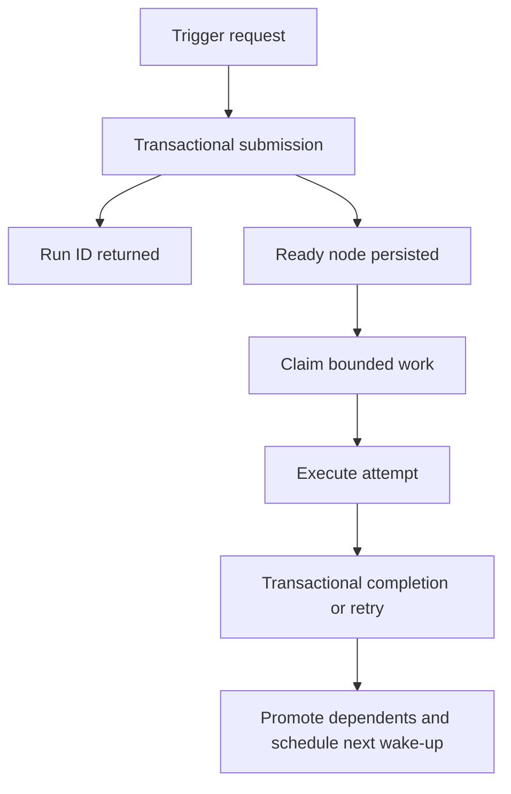

# RFD0002 - Durable Runtime Correctness and Unification

- Feature Name: `durable-runtime-correctness`
- Start Date: `2026-09-22`
- Status: Proposed
- Implementation Plan: [`.agents/plans/RFD0002-implementation-checklist.md`](../../.agents/plans/RFD0002-implementation-checklist.md)

## Summary

LibClank will converge its local and Cloudflare execution paths on one persisted scheduler contract and implement the correctness guarantees currently exposed by its APIs and documentation. Trigger acceptance will be idempotent and separate from execution, task retry and cache metadata will be enforced, events will have stable per-run ordering, graph semantics will be represented explicitly, and dynamic work will run as bounded durable instances. The local SQLite runtime will remain the reference implementation; a per-run Cloudflare Durable Object will implement the same lifecycle rather than a parallel hard-coded scheduler.

## Motivation

LibClank has a strong foundation: workflow source remains typed TypeScript, executable closures remain in the deployment, and durable storage records definitions and execution facts. The current implementation does not yet enforce several contracts implied by that model:

- every trigger call creates a new run even when delivery is duplicated;
- persisted per-task retry and cache metadata are not applied end to end;
- trigger requests synchronously drain a run instead of durably accepting work and returning;
- local and Cloudflare runtimes use different execution models;
- graph edges are partly reconstructed from generated ID suffixes;
- `forEach` and some fan-out behavior execute inside one in-memory Effect;
- event ordering depends on millisecond timestamps;
- agent retries always report attempt `1`;
- state changes spanning run creation, node creation, dependencies, and events are not one explicit transaction.

These gaps matter most during duplicate delivery, process interruption, deployment replacement, and partial failure—the situations for which a durable scheduler exists.

Concrete use cases are:

1. A webhook sender retries after a timeout. The same idempotency key must resolve to the original run without executing the workflow twice.
2. An agent task fails transiently. Its declared retry policy must determine whether and when another attempt runs, and the agent endpoint must receive the real attempt number.
3. A Worker accepts a long-running workflow. The request must return after persistence while a per-run Durable Object continues work through alarms.
4. A scheduler crashes after claiming a node. An expired lease must make the node eligible for a later attempt without corrupting completed work.
5. A collection expands to thousands of items. Each item must have persisted state while configured concurrency limits protect providers and platform limits.
6. An operator reads a run log. Events must appear in the exact order in which the scheduler committed them.

## Goals and non-goals

### Goals

- Define one run and node lifecycle shared by local SQLite and Cloudflare Durable Objects.
- Make trigger acceptance transactionally idempotent.
- Separate run submission from run draining while preserving a synchronous local convenience API.
- Enforce task retry, cache, schema, and attempt metadata.
- Replace inferred composition semantics with explicit compiled graph metadata.
- Persist dynamic item execution and enforce bounded concurrency.
- Define stable event ordering, recovery behavior, and terminal-state rules.
- Make the Agent endpoint a validated, authenticated, idempotent execution boundary.
- Add failure-oriented conformance tests that every scheduler database implementation must pass.

### Non-goals

- Distributed execution of one run across multiple Durable Objects.
- Exactly-once execution of arbitrary external side effects. LibClank provides durable at-least-once attempts and idempotency identities.
- Pause, resume, manual node retry, or run replay UI in this batch.
- SSE/WebSocket event streaming.
- Artifact provenance and large-payload offloading beyond preserving existing artifact references.
- A visual workflow authoring system.

## Guide-level explanation

### Submission and execution are separate

A trigger is first submitted, then executed. Submission performs one durable transaction that creates or finds a run, records its initial event, and materializes static nodes.

```ts
const submission = await scheduler.submitTrigger(triggerId, input, {
  idempotencyKey: request.headers.get("idempotency-key") ?? undefined,
})

// Always identifies the durable run. `created` is false for a duplicate key.
submission.runId
submission.created
```

Hosted adapters return `202 Accepted` with the run identity. Local applications and tests may use a convenience method that submits and drains until the run becomes terminal or waiting:

```ts
const run = await scheduler.runTrigger(triggerId, input, {
  idempotencyKey: "delivery-123",
})
```

`runTrigger` is convenience, not the hosted execution primitive.



### Idempotency has a defined scope

An idempotency key is unique per workflow and trigger. Reusing `(workflowId, triggerId, idempotencyKey)` with the same canonical input returns the existing run. Reusing it with different input returns an `IdempotencyConflict` and does not modify the existing run. If one trigger starts several workflows, each workflow gets one independently deduplicated run and the submission returns all of them.

When no key is supplied, each submission creates a new run. HTTP adapters may accept an `Idempotency-Key` header but do not invent a stable key from request content.

### Attempts are at-least-once

A claimed node has an attempt number and lease. If the scheduler disappears, the lease expires and the same node becomes eligible for another attempt. Therefore external side effects must use the execution identity:

```text
<runId>:<nodeInstanceId>:<attempt>
```

Agent requests carry the actual attempt plus a stable node-instance execution token. An endpoint can use that token to deduplicate a repeated transport call for the same attempt.

### Task policy is executable behavior

The scheduler uses each task definition's retry and cache policy:

```ts
Task.agent({
  id: Id.node("summarize"),
  retry: { maxAttempts: 3, backoffMs: 2_000 },
  cache: "by-input",
  // ...
})
```

A scheduler-level policy may cap task values but does not silently replace them. Non-retryable failures terminate the node immediately. Cache keys include the workflow definition, task identity and version, validated input, input artifacts, and executor identity. Agent executor identity includes instructions, model, skills, protocol version, and endpoint/deployment identity.

### Graph structure is compiled explicitly

Composition builds an intermediate graph with explicit execution steps and edges. Manifest compilation no longer derives semantics from IDs ending in `/then`, `/tap`, or `/fanout`.

Each edge identifies how downstream input is formed:

- `value`: pass one upstream output;
- `barrier`: wait without changing the value;
- `named`: collect named branch outputs;
- `collection`: collect dynamic item outputs in stable item order.

Generated IDs remain stable persistence identities, but names do not determine behavior.

### Dynamic work is durable and bounded

`mapEach` and `forEach` materialize one node instance per item. Items have deterministic instance IDs and persisted inputs, attempts, outputs, and errors. Workflow and task policies limit concurrent claims. Empty collections complete immediately with an empty output.

`mapEach` applies one task template. `forEach` may build a subgraph template, but its item instances use the same persisted scheduler lifecycle. No durable collection operator uses `concurrency: "unbounded"` internally.

### One runtime contract, two storage implementations

The local runtime uses SQLite and an in-process wake-up loop. Cloudflare uses one SQLite-backed Durable Object per run. The Durable Object owns coordination for that run, exposes RPC methods for submission/status where supported by the configured compatibility date, and uses one alarm for the earliest retry or unfinished work.

The deployable scheduler application declares workflows and task implementations; it does not contain a separate hand-written workflow engine.

## Reference-level explanation

### Public scheduler API

The scheduler contract will distinguish submission, progress, inspection, and convenience execution:

```ts
interface TriggerOptions {
  readonly idempotencyKey?: string
}

interface RunSubmission {
  readonly runId: RunId
  readonly created: boolean
  readonly status: RunStatus
}

interface TickResult {
  readonly claimed: number
  readonly completed: number
  readonly nextWakeAt?: number
  readonly status: RunStatus
}

interface Scheduler<Input = void, Output = unknown> {
  readonly workflows: readonly Node<Input, Output>[]
  readonly triggers: readonly TriggerDefinition[]
  submitTrigger(triggerId: TriggerId, value: unknown, options?: TriggerOptions): Promise<readonly RunSubmission[]>
  tick(runId: RunId, options?: { readonly limit?: number }): Promise<TickResult>
  runTrigger(triggerId: TriggerId, value: unknown, options?: TriggerOptions): Promise<WorkflowRun[]>
}
```

`runTrigger` remains for source compatibility during migration and is documented as a local/testing convenience. HTTP and Cloudflare adapters use `submitTrigger`.

### Run lifecycle

Runs use these states:

```text
pending -> running -> completed
                   -> failed
                   -> cancelled        (reserved; no public command in this batch)
pending/running -> blocked_definition_unavailable
```

Submission creates a `pending` run and static nodes. The first successful claim transitions it to `running`. A run becomes:

- `completed` when all required terminal outputs are completed;
- `failed` when a required node permanently fails or graph materialization is invalid;
- `blocked_definition_unavailable` when its definition exists but no compatible implementation deployment is available;
- non-terminal when nodes are ready, running, pending, or waiting for retry.

Waiting for a retry is not a failed run.

### Node lifecycle and atomic transitions

The existing node states remain, with transitions enforced by storage operations rather than only by a helper:

```text
pending -> ready -> running -> completed
                         |--> retry_wait -> ready
                         `--> failed
```

The database API will expose coarse operations instead of requiring callers to compose correctness-sensitive writes:

- `createOrGetRun(...)`
- `claimReadyNodes(runId, now, limit, leaseMs)`
- `completeNode(claim, output, events)`
- `failNode(claim, error, retryDecision, events)`
- `recoverExpired(runId, now)`
- `reconcileRun(runId)`

Each operation atomically updates node state, appends ordered events, promotes eligible dependents, and updates run state where applicable. Local SQLite uses explicit transactions. Durable Object SQLite performs related synchronous SQL writes without interleaved external I/O.

A claim token containing node instance ID, attempt, and lease identity prevents a stale worker from completing a later attempt.

### Idempotency storage

`workflow_runs` stores `workflow_id`, `trigger_id`, `idempotency_key`, and a canonical input digest. A partial unique index covers non-null `(workflow_id, trigger_id, idempotency_key)`. `workflow_id` rather than definition hash keeps a retried delivery attached to the run created under the deployment that first accepted it.

`createOrGetRun` has three outcomes:

1. no existing key: insert and return `{ created: true }`;
2. matching key and digest: return existing run with `{ created: false }`;
3. matching key and different digest: throw `IdempotencyConflict`.

The operation includes initial events and static node materialization in the same transaction.

### Explicit graph manifest

`WorkflowManifest` schema version increments. It stores executable step definitions separately from explicit edges and output selection. Edges reference stable `stepId`s and contain an input mode plus optional branch key.

Manifest compilation validates:

- unique workflow-local step IDs;
- all edge endpoints exist;
- the graph is acyclic outside declared dynamic templates;
- every executable step has an implementation;
- input aggregation is unambiguous;
- one terminal output selector exists;
- dynamic templates cannot reference runtime item indices in static IDs.

Old schema-version-1 manifests remain readable for inspection. New runs use schema version 2. Existing non-terminal version-1 runs may continue only through the version-1 compatibility adapter during the migration window; otherwise they become `blocked_definition_unavailable` rather than being reinterpreted.

### Retry semantics

A task's `retry.maxAttempts` includes the first attempt. Backoff uses the persisted task value. The existing numeric `backoffMs` remains the manifest format for this batch. Scheduler configuration may define maximum attempts and maximum backoff caps.

Failure classification is:

- `retryable`: retry while attempts remain;
- `permanent`: fail immediately;
- `unknown`: retry according to task policy.

Schema validation failures and missing implementations are permanent. Agent responses preserve their `retryable` value in a typed execution error. Timeouts, if configured by a runtime, are retryable unless task policy says otherwise.

### Cache semantics

Execution keys are computed after input aggregation and schema validation, before claim execution. A cache hit completes the node through the same atomic completion operation and emits `node.cache_hit` followed by `node.completed`.

Cache reuse is allowed only for `cache: "by-input"`. The key contains:

- workflow definition hash;
- step definition and version;
- canonical validated input;
- sorted input artifact digests;
- executor identity.

Cache records reference immutable completed outputs. Undefined output is represented explicitly rather than conflated with no output.

### Events

Every event has a monotonically increasing sequence scoped to its run. Storage assigns the sequence in the same transaction as the state change. APIs order by sequence and support future cursor reads using `(runId, sequence)`.

The event union adds events needed to explain scheduler decisions:

- `node.retry_scheduled`;
- `node.lease_expired`;
- `node.cache_hit`;
- `workflow.blocked`.

Wall-clock timestamps remain metadata and are never used as the ordering key.

### Dynamic instances and concurrency

A dynamic parent materializes deterministic item instances and dependency rows atomically. The parent waits in a non-claimable aggregation state represented by persisted dependencies, not immediate zero-delay retry polling. Child outputs aggregate by item ordinal, not row insertion order.

Claim limits are applied in this order:

1. runtime-wide cap;
2. workflow cap;
3. task cap;
4. dynamic operator cap.

The first implementation may enforce only runtime and dynamic operator caps, provided the manifest fields and storage query leave room for the remaining levels.

### Cloudflare runtime

One `WorkflowRun` Durable Object owns one run. The public Worker maps a new run ID to `WORKFLOW_RUN.getByName(runId)`. The object:

1. transactionally initializes the run;
2. schedules immediate work with `ctx.waitUntil` after persistence;
3. executes a bounded tick;
4. stores results before scheduling more work;
5. sets its single alarm to the earliest `nextWakeAt`;
6. reconstructs all in-memory state from SQLite after eviction.

Schema setup occurs during constructor initialization. External agent calls occur outside storage transactions. Completion uses claim tokens so an old response cannot overwrite newer state.

The existing hard-coded scheduler application and the package-level `CloudflareWorkflowRun` prototype are replaced by one adapter over the shared manifest, registry, and lifecycle contracts.

### Agent boundary

`AgentTaskRequest` gains:

- actual attempt number;
- node instance ID;
- execution token;
- deployment/executor identity.

Request and response bodies are runtime-validated and size-limited. Service bindings remain preferred. Deployments configure authentication for any non-binding transport; no secret is stored in workflow definitions or logs. Repeated delivery of the same execution token must return the same result or indicate that it is still running.

### Observability

Structured logs include run ID, node instance ID, attempt, event sequence, definition hash, and deployment ID. Payloads, instructions, credentials, and full model output are excluded by default. The Worker deployment enables logs and traces in Wrangler configuration, with sampling chosen by the application.

Metrics derived from events include run latency, queue/wait time, attempt latency, retries, lease expiry, cache hits, and terminal failures.

### Compatibility and rollout

The implementation rolls out additively:

1. add schema columns, sequence support, and transactional database operations;
2. add new scheduler APIs while retaining `runTrigger`;
3. compile and execute manifest schema version 2 locally;
4. migrate dynamic operators and policy enforcement;
5. add the shared Cloudflare database/runtime adapter;
6. replace the hard-coded scheduler app;
7. deprecate version-1 execution and old Cloudflare prototypes.

No existing completed run is rewritten. APIs continue to inspect historical version-1 manifests and events.

### Validation plan

A scheduler database conformance suite runs against an in-memory/fake implementation where useful, real local SQLite, and Durable Object SQLite. Required scenarios include:

- duplicate idempotency key with equal and unequal input;
- concurrent duplicate submissions;
- crash after claim and lease recovery;
- stale completion after a later claim;
- crash after external completion but before local persistence;
- task-specific retry limits and permanent failures;
- cache hit, miss, and executor-identity invalidation;
- deterministic event ordering under same-millisecond writes;
- fan-out empty, partial failure, retry, and stable aggregation order;
- bounded concurrency;
- unavailable deployment definition;
- Agent request validation, authentication, timeout, and retry propagation;
- semantic equivalence between local and Cloudflare execution.

## Security and privacy

Workflow inputs and agent outputs may contain sensitive data. Event and structured-log contracts must avoid copying payloads by default. Runtime schemas validate untrusted HTTP and Agent protocol data. Agent authentication uses service bindings where possible and secrets otherwise. Idempotency keys are opaque identifiers and must not embed credentials or user data.

Cache entries can leak results across contexts if their key omits executor or tenant identity. Applications requiring tenant isolation must include tenant scope in input or executor identity; cross-tenant caching is not implicit.

## Acceptance criteria

This RFD is implemented when:

- local and Cloudflare runtimes pass the same lifecycle conformance suite;
- duplicate keyed submissions cannot create two runs;
- task retry and cache policies affect execution as documented;
- hosted trigger handlers return after durable submission;
- all run events have stable sequence ordering;
- no durable collection operator executes with unbounded concurrency;
- Cloudflare deployment uses the shared scheduler rather than a bespoke workflow engine;
- Agent requests carry actual attempts and are runtime-validated;
- crash/lease recovery tests pass on local SQLite and Durable Object SQLite;
- README and RFD0001 are updated to distinguish implemented guarantees from future work.

## Drawbacks

- This introduces meaningful schema and API changes before the library reaches a stable release.
- Explicit graph compilation is more code than suffix-based inference.
- Transactional database operations make `SchedulerDatabase` less minimal and require stronger conformance tests.
- At-least-once attempts still require application-level idempotency for arbitrary external side effects.
- A per-run Durable Object simplifies coordination but can bottleneck extremely large single runs.
- Runtime validation, authentication, and cache identity increase request metadata and configuration.
- Supporting inspection of version-1 manifests adds temporary migration complexity.

## Rationale and alternatives

### Continue patching each runtime independently

This is initially simpler, but guarantees would continue to diverge and every feature would need separate semantics. It is rejected in favor of one lifecycle contract with platform-specific storage and wake-up adapters.

### Use only Cloudflare Workflows

Cloudflare Workflows could provide hosted durable steps, but it would not satisfy the current goal of one code-first model that also runs against local SQLite. It may become a future execution adapter rather than the authoritative model.

### Keep synchronous trigger execution

This is convenient for tests but unsafe as the hosted primitive for long-running work. The proposal retains it as a convenience wrapper while making submission explicit.

### Derive idempotency from input hashes

Identical payloads may legitimately represent distinct events, and semantically duplicate payloads may not serialize identically. Caller-provided delivery identity is therefore required for deduplication.

### Promise exactly-once task execution

A scheduler cannot atomically commit both its database state and arbitrary external side effects. The honest contract is at-least-once attempts plus stable execution identities and endpoint deduplication.

### Replace SQLite with a distributed database

That would increase operational scope without fixing graph, policy, or lifecycle semantics. SQLite remains appropriate for local execution and single-owner Durable Objects.

### Do nothing

The library would remain useful for deterministic local workflows, but its public durability claims would exceed its behavior during duplicate delivery, retries, and crashes. Cloudflare deployment would continue to demonstrate a different engine from the package API.

## Prior art

Temporal separates durable workflow history from activity execution and treats activities as retryable, potentially repeated work. Airflow and other DAG schedulers compile explicit dependency graphs rather than inferring behavior from generated names. Cloudflare Durable Objects provide a single-owner coordination boundary and one alarm per object, which fits one coordinator per run. Content-addressed build systems show why cache keys must include implementation and environment identity rather than only raw input.

LibClank intentionally remains smaller than those systems. The lesson adopted here is explicit lifecycle and identity, not API compatibility or feature parity.

## Unresolved questions

### Before acceptance

- Should a fan-out with independent branches fail fast, finish all branches, or make this an explicit workflow policy?
- What minimum executor identity must custom `AgentEndpoint` implementations provide for cache safety?

### During implementation

- Whether schema-version-1 non-terminal runs warrant an execution adapter or should immediately become blocked.
- The initial default and maximum claim/concurrency limits for local and Cloudflare runtimes.
- Whether Agent endpoint deduplication belongs in the protocol package or a reusable runtime helper.

### Out of scope

- Operator-initiated cancellation and retry commands.
- Cross-run rate limiting.
- Event streaming and replay UI.
- Multi-object sharding for exceptionally large runs.

## Future possibilities

- Cooperative cancellation and pause/resume.
- Queue-backed execution for cross-run fairness.
- OpenTelemetry export from persisted events.
- SSE using the event sequence as a reconnect cursor.
- Artifact-backed large inputs and outputs.
- Run replay and run comparison across definition versions.
- Additional hosted adapters, including Cloudflare Workflows, that satisfy the same conformance contract.
