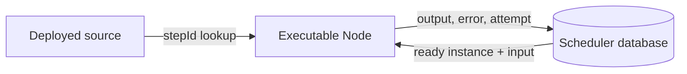

# Mental model

LibClank separates **workflow source code** from **durable execution state**.

## Source side

Your deployed TypeScript contains:

- task functions;
- agent endpoints;
- schemas;
- trigger decoders;
- workflow composition;
- a registry from step IDs to executable nodes.

## Persistence side

The scheduler database contains:

- content-hashed workflow manifests;
- runs;
- node/step instances;
- dependency rows;
- attempts and leases;
- JSON inputs and outputs;
- artifact references;
- serialized errors;
- append-only operational events.

It does **not** contain JavaScript closures.



## Node and Task

`Node<Input, Output>` is the composable graph value. It carries:

- an executable Effect-producing function;
- triggers;
- serializable definitions;
- source-loaded implementations;
- optional input/output schemas.

A `Task` is a user-facing node constructor:

```ts
const normalize = Task.fn<string, string>({
  id: Id.node("normalize"),
  run: (input) => Effect.succeed(input.trim().toLowerCase()),
})
```

Use `Task.effect<Input>` for work whose meaningful result is `void`:

```ts
const notify = Task.effect<Message>({
  id: Id.node("notify"),
  run: (message) => Effect.promise(() => sendMessage(message)),
})
```

## Task ID versus step ID

These IDs solve different problems:

- **`taskId` / `NodeDefinition.id`** identifies reusable source code.
- **`stepId`** identifies one call site in one composed workflow.

For example, one `open-file` task can be reused in three branches:

```text
analyze-topic/tap/open-file
analyze-style/tap/open-file
analyze-confidence/tap/open-file
```

All three use the same function, but each has independent durable state and dependencies. Persisting only the reusable task ID would make those call sites ambiguous.

Use stable, descriptive IDs:

```ts
Id.node("fetch-markdown")
Id.node("analyze-writing-style")
Id.trigger("analyze-url")
```

IDs become canonical LibClank URIs, for example:

```text
libclank://node/fetch-markdown
libclank://trigger/analyze-url
```

Changing a task ID changes durable identity. Treat IDs as part of your deployment compatibility contract.

## Workflow manifest

A manifest is a persistable snapshot of workflow structure:

```ts
interface WorkflowManifest {
  schemaVersion: 1
  workflowId: WorkflowId
  definitionHash: `sha256:${string}`
  tasks: readonly NodeDefinition[]
  triggers: readonly PersistedTriggerDefinition[]
  edges: readonly WorkflowManifestEdge[]
}
```

The definition hash covers canonical task, trigger, and edge metadata. A changed graph creates a new historical definition. Existing runs retain their original hash.

The executable functions are deliberately absent. On execution, the scheduler uses the persisted `stepId` to find the implementation in the currently loaded source registry.

## Run

A run is one activation of one workflow definition:

```text
run ID
workflow definition hash
status
input
created/updated timestamps
```

Current run statuses are:

```text
pending
running
completed
failed
cancelled
blocked_definition_unavailable
```

Not every status has a complete public operator command yet; see the limitations reference.

## Node instance

A node instance is the durable unit of work. It records:

```text
instance ID
run ID
step/node ID
status
input and input artifacts
output and output artifacts
execution key
attempt
retry time
lease expiration
serialized error
```

Typical transitions are:

```text
pending → ready → running → completed
                         ├→ retry_wait → running
                         └→ failed
```

Dependent nodes remain `pending` until all required predecessors complete.

## Source registry

At deployment startup, workflow composition exposes implementations and `createStepRegistry` indexes them by `stepId`.

On retry or recovery, the scheduler does not deserialize code. It asks:

```text
Which source-loaded implementation owns this persisted stepId?
```

If no compatible implementation is registered, execution must fail or block rather than running arbitrary code.

## Events and observers

These mechanisms are related but distinct:

- **Persisted scheduler events** are durable operational history.
- **`SchedulerObserver` callbacks** provide best-effort process-local logging or metrics.

Observer failures are intentionally non-fatal. An exception in logging must not stop scheduling.

Typical persisted events are:

```text
trigger.received
workflow.scheduled
node.started
node.completed
node.failed
workflow.completed
```

The dashboard reads these events for its run log.

## The authoritative boundary

For durable execution, always reason from persisted state:

- a function returning does not count until output is persisted;
- a node is runnable because its durable dependencies are complete;
- retries use persisted input;
- process memory is disposable;
- external side effects should be idempotent or guarded by stable execution identity.

That last point matters: a lease can expire after an external side effect happened but before completion was committed. Durable execution is generally **at least once**, not magically exactly once.
